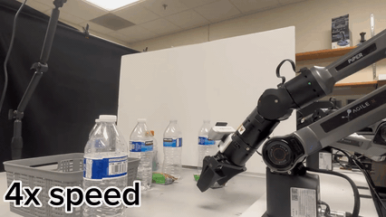
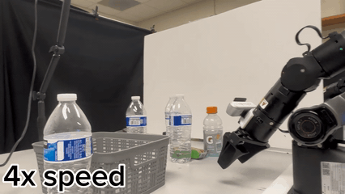
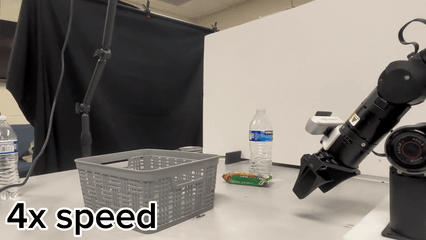

  

<h1 align="center">UniPred</h1>

  <b>Unifying Deep Predicate Invention with Foundation Models for Long Horizon Planning</b>

## Demo Videos

### Main Demo

  

  <b>UniPred performs long horizon planning with a learned neural-symbolic world model.</b>

### Demos for Other Tasks

<table>
  <tr>
    <td align="center" width="50%">
       
      <b>Table Clean</b> 
      Train Task
    </td>
    <td align="center" width="50%">
       
      <b>Table Clean</b> 
      Test Task
    </td>
  </tr>
</table>

<table>
  <tr>
    <td align="center" width="33%">
       
      <b>Pick Target in Clutter</b> 
      Test Task
    </td>
    <td align="center" width="33%">
       
      <b>Pick Target in Clutter</b> 
      Test Task
    </td>
    <td align="center" width="33%">
       
      <b>Pick Target in Clutter</b> 
      Train Task
    </td>
  </tr>
</table>

### Failure Recovery

  

  <b>UniPred replans from observation feedback and recovers from execution failures.</b> 
  Across 13 execution steps, the system detects action failures, replans, and completes the task.

  
  

### Remaining Failure Cases

  
  
  

  <b>Long horizon manipulation remains challenging.</b> 
  Planning errors and accumulated execution errors can still cause failures over extended task horizons.

